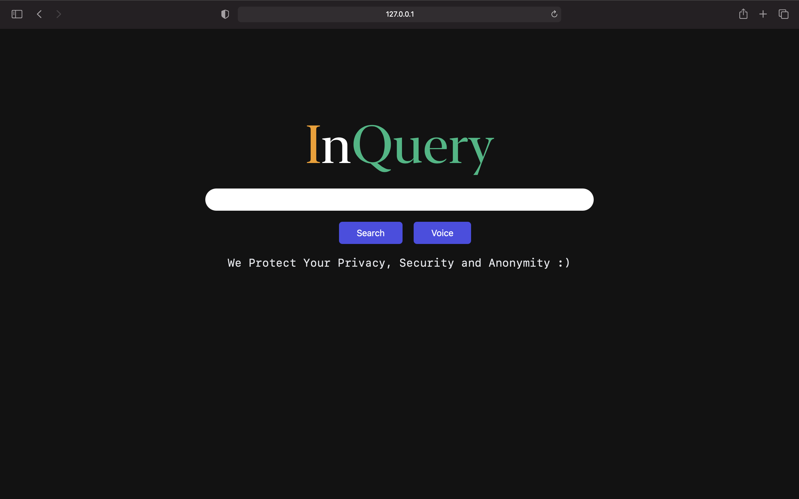
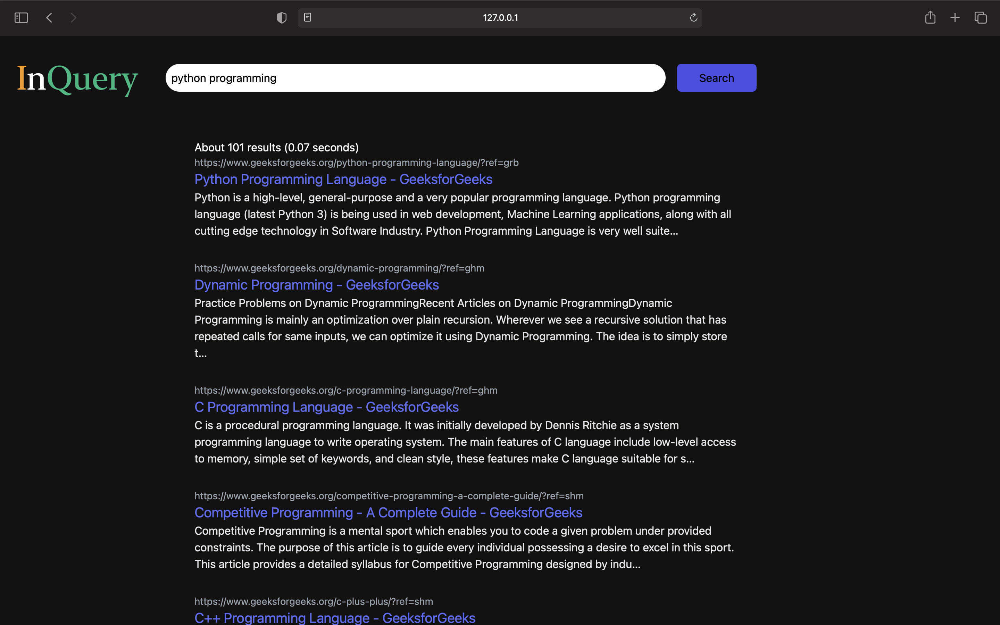
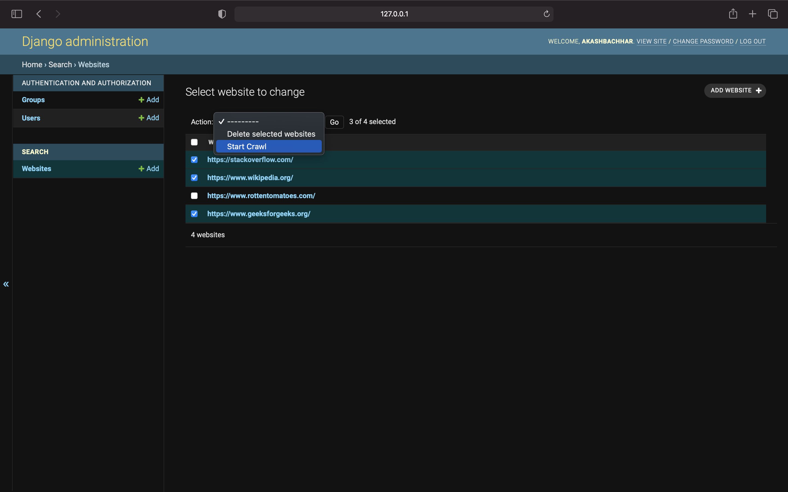

# Inquery

This is a search engine website with following features.


## Features

- Search results based on a textual search query and ranking algorithm
- Sites can be crawled from the admin panel itself
- Voice search functionality
## Screenshots





  
## Tech Stack

**Client:** HTML, CSS, TailwindCSS

**Server:** Python, Django

**Database:** Mongodb

**Other Necessary Libraries:** 

* Beautiful Soup
* Pymongo
* Natural Language Toolkit
* PyAudio
* Speech Recognition
* And lots more

  
## Run Locally

Install and open Mongodb

```bash
  https://docs.mongodb.com/manual/installation/
```

Create a new directory 
```bash
  mkdir inquery
```

Create a virtual environment

```bash
  sudo apt-get install python3-venv
  python3 -m venv env
```
Clone the project

```bash
  git clone https://github.com/akashbachhar/inquery
```

Activate the virtual environment

**Linux/Mac:**

```bash
  source env/bin/activate
```

**Windows:**

```bash
  .\Scripts\activate
```

Install the requirements

```bash
  cd inquery
  pip install -r requirements.txt
```

Run the migrations 

```bash
  python manage.py makemigrations
  python manage.py migrate
```

Run the Development Server 

```bash
  python manage.py runserver
```
Head to server http://127.0.0.1:8000/admin, add the websites to be crawled and start crawling.


  