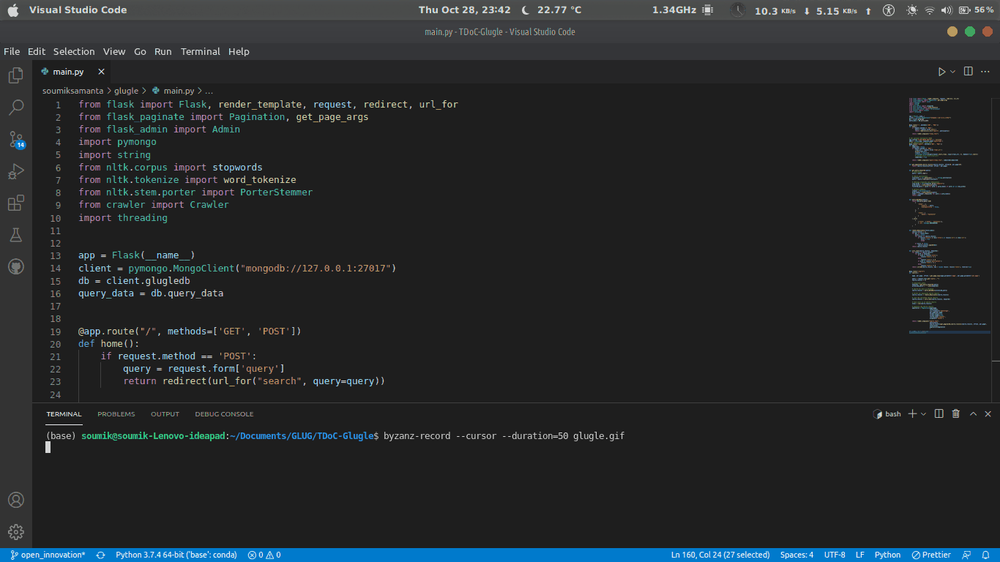

## Overview

**glugle** is a search engine built using -

* Python to implement the core logic of the application
* Flask web framework to route the web requests
* mongo db as a database to store the crawled data and maintain indexes to facilitate fast searching

This project was made as a part of **10 Days of Code** event organized by [GNU/Linux Users&#39; Group, NIT Durgapur](https://github.com/lugnitdgp)

## Working

The web application consists of 4 basic parts:

1. **Crawling** - Web search engines get their information by crawling from site to site. The crawler is provided with an entrypoint from which it starts collecting the links and text data and storing them in the database.
2. **Indexing** - Indexing means associating the data found on the web pages with the domain it was found on and HTML fields. The way data is stored in the database is a major contributor to the efficiency of the search engine.
3. **Searching** - Searching means to search the database for relevant results to the search query.
4. **Ranking** - Ranking means to rank the search results found from the above operation in order of their relevance to the user. The better ranking system results in a better search experience.

There is also an **admin panel** at **/admin** to submit new domain URLs to crawl data from. [Part of open innovation]

## Future Ideas:

* [ ] Voice Search, by converting input speech to text and forming query to search
* [ ] Image Search, probably using Google Vision API to get summary of input image and forming query to search
* [ ] Login System using Flask Secuirity
* [ ] Narrow down search results, based on user's previous/recent searches

## To run the project

* clone the repository
* cd into the project directory
* Run command `python main.py `
